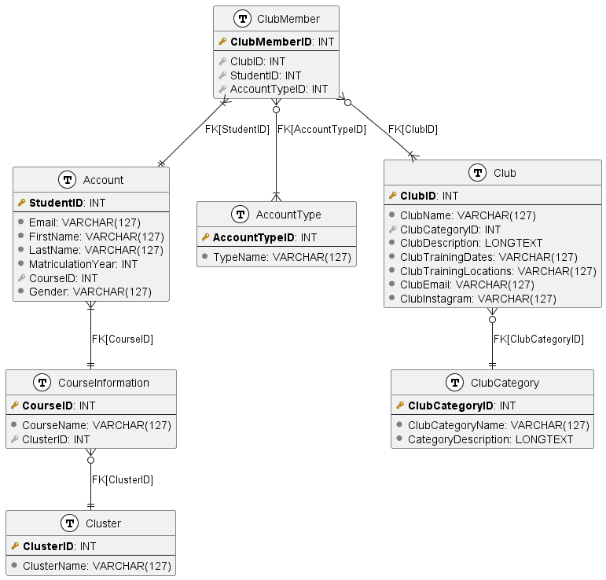

# InClubSIT Backend

Simple backend application for SIT students to manage their club information, membership and news.

# Requirements
- Python ≥3.10
- Docker

# Entity-Relationship Diagram


# Usage
1. Ensure that a Firebase `key.json` file is in the `mount` and `config` directories.
2. Run
```sh
pip install -r requirements.txt
```
3. If there is no `mount/initialise.sql` file, or there have been changes to the `mount/codegen.py` script, run
```sh
cd mount
python codegen.py
```

4. Starting the app with docker
```sh
docker compose down --rmi local --volumes && docker-compose up
```

5. The backend API documentation can be found at `<ip-address>:8001/docs`